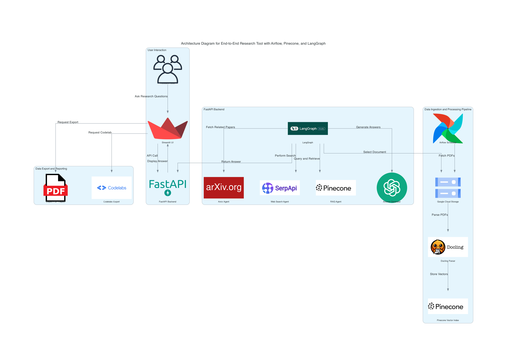

# Assignment-4

## Objective
Build an end-to-end research tool using an Airflow pipeline for document processing, vector storage with Pinecone, and a multi-agent research system powered by LangGraph. The system enables efficient document-based research, query answering, and exportable findings.

---

## Problem Statement
Research often involves parsing through extensive documents, retrieving relevant data, and synthesizing actionable insights. Current methods are time-consuming and inefficient, relying heavily on manual work. This project addresses the need for automation and intelligence in research workflows by building a pipeline to process documents, store vectors for similarity search, and create a multi-agent system for enhanced research capabilities.

---

## Project Summary
This project automates the ingestion, processing, and retrieval of publication data using advanced technologies. Key features include:
1. **Airflow Pipeline**: Automates document parsing using Docling and stores vectors in Pinecone for similarity search.
2. **Multi-Agent System**: Utilizes LangGraph to orchestrate research tasks, including document selection, Arxiv-based research, web search, and answering queries with Retrieval-Augmented Generation (RAG).
3. **User Interaction**: Provides an interface using Streamlit for users to ask questions, save research sessions, and export results in professional formats.

---

## Technologies Used
[](https://www.python.org/)  
[](https://cloud.google.com)  
[](https://www.pinecone.io/)  
[](https://airflow.apache.org/)  
[](https://langgraph.ai/)  
[](https://fastapi.tiangolo.com/)  
[](https://streamlit.io/)  
[](https://docling.ai/)  
[](https://github.com/)

---

## Architecture Diagram


---

## Project Structure

### Part 1: Document Parsing, Vector Storage, and Pipeline Setup
1. **Airflow Pipeline**:
   - Uses Docling to parse documents, extracting structured text from PDFs.
   - Stores document vectors in Pinecone for efficient similarity search.
   - Automates the end-to-end pipeline using Apache Airflow.
2. **Technologies**:
   - Docling for document parsing.
   - Pinecone for vector-based storage and retrieval.
   - Airflow for automation and orchestration.

---

### Part 2: Research Agent with Pinecone and LangGraph
1. **Research Agents**:
   - **Document Selector**: Enables selection of documents processed in Part 1.
   - **Arxiv Agent**: Searches for related research papers on Arxiv.
   - **Web Search Agent**: Performs broader online research for context.
   - **RAG Agent**: Uses Retrieval-Augmented Generation (RAG) to answer questions based on the document's content.
   - **Answer Generator**: Provides concise answers or summaries using OpenAI or similar APIs.

2. **Workflow**:
   - Agents are orchestrated by LangGraph, interacting with Pinecone for vector retrieval and external APIs for additional insights.
   - Pinecone facilitates fast similarity search, enhancing query efficiency.

---

### Part 3: Research Interface and Q/A Interaction
1. **User Interface**:
   - Built using Streamlit to allow users to:
     - Ask 5-6 questions per document.
     - View structured answers or summaries.
     - Save research session results.
2. **Export Results**:
   - **PDF Export**: Generates professional reports summarizing findings.
   - **Codelabs Export**: Structures findings for instructional use.

---

## Features
1. **Document Processing**:
   - Automates document ingestion, parsing, and vector storage.
2. **Multi-Agent System**:
   - Offers advanced research capabilities through document selection, Arxiv search, web search, and RAG-based Q/A.
3. **User-Friendly Interface**:
   - Simple yet powerful interface for research interaction and result export.

---
## Demo Video
Available in the codelabs document

---

## How to Run the Application Locally

### Step 1: Clone the Repository
```bash
git clone [https://github.com/your-repo-name.git](https://github.com/BigDataIA-Fall2024-TeamA7/Assignment-4.git)
cd Assignment-4
```

### Step 2: Configure Environment Variables
Create a `.env` file with the following:
```
PINECONE_API_KEY=your_pinecone_api_key
GCP_CREDENTIALS=path_to_gcp_service_account.json
OPENAI_API_KEY=your_openai_api_key
```

### Step 3: Build and Run Docker Containers
```bash
docker-compose up --build
```

### Step 4: Access Services
- **Streamlit App**: [http://localhost:8501](http://localhost:8501)
- **FastAPI**: [http://localhost:8000/docs](http://localhost:8000/docs)
- **Airflow**: [http://localhost:8080](http://localhost:8080) (default credentials: `airflow`/`airflow`)

---

## Proof of Concept (PoC)
- Successfully parsed a subset of documents using Docling.
- Stored and queried vectors in Pinecone with high efficiency.
- Developed a LangGraph-based multi-agent system.
- Deployed a prototype user interface in Streamlit for testing.

---

## Submission Links
- **Codelabs**: [Codelab Documentation](https://codelabs-preview.appspot.com/?file_id=https://docs.google.com/document/d/1_veVgLEZew3sWC_vCtCP68glH-6uxFbS87cYLzr7R6Y/edit?tab=t.0#6)

---

## Team Contributions
| Name                        | Contribution % | Contributions                                                              |
|---------------------------- |----------------|----------------------------------------------------------------------------|
| Sai Pranavi Jeedigunta      | 33%            | Docling parsing, vector storage, Airflow pipeline, Arxiv Agent, Web search |
| Akanksha Pandey             | 33%            | RAG setup, Deployment, Exporting Results                                   |               
| Kalash Desai                | 33%            | User interface design, Streamlit development                               |

---

## **Attestation and Contribution Declaration**:
   > WE ATTEST THAT WE HAVEN’T USED ANY OTHER STUDENTS’ WORK IN OUR ASSIGNMENT AND ABIDE BY THE POLICIES LISTED IN THE STUDENT HANDBOOK.
